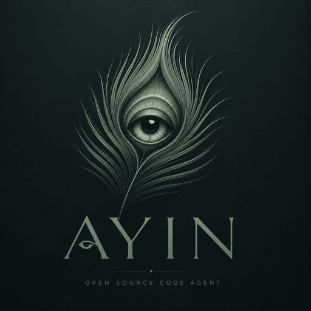

<p align="center">
  
</p>

<h1 align="center">ayin</h1>

<p align="center"><em>An agentic loop in your shell — read, search, edit, run, iterate — driven by an
open-weights model you host yourself.</em></p>

---

ayin runs on Ollama, on any endpoint serving a tiny HTTP contract, or on OpenAI. Full-screen TUI for
live work, headless `-p` for scripting. Run it locally and your code never leaves your machine; run it
on an OpenAI key and you need no GPU at all.

> **ayin** (עין) — "eye". A small agent that looks at your code and acts.

```
┌──────────────────────────────────────────────┐
│  > add a /health endpoint and a test for it   │
│                                                │
│  ⠹ Running bash(npm test) 3s                  │
│  ● connected  qwen3-coder:30b   1.2k/32k tok  │
└──────────────────────────────────────────────┘
```

## Why ayin

- **Local-first & open, but not local-only.** Point it at your own Ollama server and no API key is
  required — your code never leaves your machine. Point it at OpenAI (`/openai sk-…`) and it runs on a
  laptop with no GPU. ayin never moves a session onto the paid provider by itself.
- **Model-agnostic.** A small **LLM-manager + dialect** layer (`src/llm/`) isolates the
  only thing that differs between models — how tool calls are formatted and parsed — so
  ayin works with **gemma**, **Qwen3-Coder**, and is a ~30-line dialect away from any
  other. The active model is detected at runtime; the right dialect is selected
  automatically. See [`docs/ARCHITECTURE.md`](docs/ARCHITECTURE.md).
- **Tool-calling either way.** Against a runtime that accepts tool schemas (Ollama, OpenAI) ayin
  declares them natively, so the model emits the syntax it was trained on and the prompt carries no
  tool catalogue at all. Against a plain text endpoint it falls back to the XML convention
  (`<function=…><parameter=…>`) open coder models emit, with a lenient parser for each model's
  quirks. Same loop, same parser — the provider decides which.
- **Web search with no key and no container.** `web_search` queries DuckDuckGo in-process and reads
  the top pages itself — nothing to install, nothing to sign up for. Point it at your own
  [SearXNG](https://github.com/searxng/searxng) if you have one and it will prefer that.
- **Headless or interactive.** A blessed TUI for live work; `-p "task"` for one-shot,
  scriptable runs (CI, batch jobs, parent agents).

## Quickstart

From nothing to a running agent. Pick the model you have: an **OpenAI key**, or a **local GPU**.

```bash
git clone --recursive https://github.com/minorusan/ayin.git && cd ayin
./install.sh
```

`install.sh` does the whole thing and verifies its own result: prerequisites (Node 18+), submodule,
**unregisters any existing `ayin`** so two of them cannot fight over PATH, pulls the latest, installs,
builds, and points the global `ayin` command at this checkout. Safe to re-run. `--no-link` builds without
touching the global command; a root-owned `ayin` that npm does not manage is **reported, not deleted**
(`--replace-system-bin` if you do mean it).

By hand, if you prefer:

```bash
npm install                       # 4 deps: blessed, openai, sharp, undici
npm run build
npm link                          # puts `ayin` on PATH
```

**On first launch ayin asks.** It will not open the TUI with no model configured — a fresh clone that
started up and then failed on the first prompt looked broken rather than unconfigured. It detects a local
Ollama if you have one, offers OpenAI otherwise, **verifies whatever you give it**, saves it, and starts:

```
  ayin — first run
  Found an Ollama on this machine (http://127.0.0.1:11434, 10 model(s)).

  1) Use that local Ollama                 [recommended — nothing leaves this machine]
  2) OpenAI API key                        [hosted; needs no GPU]
  3) An endpoint serving ayin's HTTP contract
  q) Quit
```

Already know what you want? Skip the questions by configuring it up front:

```bash
node dist/index.js                # asks, if nothing is configured yet
/openai sk-…                      # verified with OpenAI, then saved to ~/.ayin-cli/openai.env (0600)
```

It asks **once**, and it asks even when something already works — an env var inherited from a shell
profile is not a decision you made. Whatever already answers is offered as the default, so confirming is
one keypress, and the choice is recorded (`onboardedAt`) so you are never asked again.

After that it only checks that a model still **answers**: an `AYIN_MODEL_URL` pointing at a LAN you are
not currently on gets you the menu with a **Retry** option, not a TUI that fails on your first prompt. An
OpenAI key is taken at face value, since it was verified when you set it.

> **The endpoint variable is `AYIN_MODEL_URL`.** It was `AYIN_LLM_URL`; that name is no longer read,
> because a line left in a shell profile silently satisfied setup and skipped the one moment ayin has to
> explain itself. If the old one is still exported, ayin says so and ignores it.

`ayin version` and `ayin update` work regardless. A `-p` run or the `watch` daemon never prompts — with
nothing reachable they exit with the same instructions, because there is nobody there to answer.

### `ayin update` updates what `ayin` runs

If the binary resolves to a git checkout — an `npm link`ed clone, which is the normal setup — `ayin
update` **pulls that checkout, installs, rebuilds, and re-points the global command at it**. It used to
install the global package from a registry, which on a linked machine changes something other than what
runs, and reports success while the old build keeps going.

```bash
ayin update --check      # fetch and report; touches nothing, works on a dirty tree
ayin update              # pull → npm install → npm run build → remap → restart the watch daemon
ayin update --force      # pull even with uncommitted changes in the checkout
ayin update --registry <url>   # the old path, for a genuine registry install
```

`npm install` is never skipped: a pull that adds a dependency otherwise leaves a tree that cannot
compile. A **dirty checkout is refused** — someone else's uncommitted work is not this command's to
stash, and a conflict mid-update leaves a build matching no commit.

**With a local model** — nothing leaves your machine, and no account anywhere:

```bash
ollama pull qwen3-coder:30b       # or qwen2.5-coder:7b on 8 GB

AYIN_LLM_PROVIDER=ollama node dist/index.js                      # the TUI
AYIN_LLM_PROVIDER=ollama node dist/index.js -p "explain src/agent.ts"   # one-shot
```

`--recursive` fetches [naamah](https://github.com/minorusan/naamah-uml), the diagram renderer. Forgot it?
`git submodule update --init`. Skipped it entirely? Everything works except drawing pictures.

### Put `ayin` on your PATH

Running `node dist/index.js` from a checkout works, but you want a command you can invoke from any
project directory — ayin's tools operate on the **current working directory**, so where you launch it is
where it works.

```bash
npm link                  # from the ayin checkout — symlinks the `ayin` bin globally
# or, equivalently:
npm i -g .

cd ~/some/other/project
ayin                                              # TUI, working on THIS directory
ayin -p "explain the build setup"                 # one-shot
ayin version
```

`npm link` keeps the symlink pointing at your checkout, so `git pull && npm run build` updates the
installed command with no reinstall — which is what you want while you are still changing ayin. Use
`npm i -g .` for a fixed copy instead.

If the global prefix is not writable you will be told to re-run with `sudo`; on a system-owned prefix
(`/usr`) that is expected. To avoid `sudo` entirely, point npm at a user-owned prefix once:

```bash
npm config set prefix ~/.local        # then re-run npm link
export PATH="$HOME/.local/bin:$PATH"  # add to your shell profile
```

Persist the model choice so you stop passing env vars every time:

```bash
ayin
/set llm-provider ollama
/set ollama-model qwen3-coder:30b
```

Those live in `~/.ayin-cli/prompts.json`, outside any repo, and are read fresh on every access.

### What you need, and what you don't

| Required | |
|---|---|
| **Node ≥ 18** | global `fetch` and `AbortSignal.timeout` |
| **a POSIX shell** | the file tools shell out to `grep`/`find`; on Windows use WSL or Git Bash |
| **a model** | an OpenAI key is enough — Ollama or an HTTP-contract endpoint if you'd rather run local |

| Optional — absent, the feature simply isn't there | |
|---|---|
| `plantuml` | `diagram`, `arduino_diagram`, and rendering a design |
| `arduino-cli` | compiling/uploading sketches |
| a SearXNG instance | web search prefers it; DuckDuckGo is the keyless default |
| a Jira token | `/jira` — your current sprint, asked in plain words |
| a Sentry token | `/sentry` — what is failing in production, asked in plain words |

### The shortest way to a working ayin

No GPU, no model download, no local runtime:

```bash
npm install && npm run build
node dist/index.js
/openai sk-…            # your key — verified with OpenAI, then saved (0600)
```

With nothing else configured ayin **defaults to OpenAI**, so that is the whole setup. If you have no
key yet it says so on the first prompt and names all three ways to set one. To go local later, point it
at Ollama or an endpoint (`/set llm-provider ollama`) — a configured endpoint always wins over the
default, and ayin never moves a session onto a billed provider on its own.

Nothing above is checked at startup and nothing fails obscurely: a tool whose dependency is missing says
which one, and the rest of the agent carries on.

**Full instructions — including the four ways to connect an LLM — are in
[`SETUP.md`](SETUP.md).**

### Installing from a registry

If ayin is published to an npm registry (a private one is fine — that is how it's distributed on
the author's LAN), you can skip the checkout entirely:

```bash
npm i -g ayin --registry http://<registry-host>:4873
ayin                      # TUI
ayin version              # what you're running
ayin update               # fetch + install the newest build
ayin update --check       # report only, install nothing
```

`ayin update` resolves the registry from `--registry` → `AYIN_UPDATE_REGISTRY` →
`/set update-registry <url>` (persisted per machine) → npm's own configured registry, and shells out
to `npm i -g` so a half-finished download can never replace a working binary. If the global prefix
isn't writable it tells you to re-run with `sudo`. Running from a source checkout, it says so —
there, updating is `git pull && npm run build`. If a **`watch` daemon is running**, a successful
update restarts it for you (SIGTERM, wait for exit, relaunch `ayin watch`), so it doesn't keep
reviewing commits on the old build until someone notices.

> **`ayin` is a taken name on public npm, and that package is not this one.** `ayin update` therefore
> **refuses** to fall back to registry.npmjs.org: a machine whose npm defaulted to the public
> registry resolved `latest` to a stranger's `0.0.2`, and only the "local build is ahead" check
> stopped it — `--force` would have installed someone else's code over the agent. Point it at your
> own registry once with `/set update-registry http://<host>:4873`. Passing
> `--registry https://registry.npmjs.org/` explicitly is still honoured, with a warning.

The status bar carries `↑ vX available` when the registry has a newer build (checked at boot and
every 10 min). It only ever asks a **private** registry — `AYIN_UPDATE_REGISTRY`, or npm's own
configured registry when that isn't public npmjs — so a fresh checkout never phones home uninvited
and can't be told a stranger's `ayin` package is your update. `AYIN_UPDATE_CHECK=0` turns it off.

## Tools

ayin's loop calls these tools (each is a unique name; the model invokes them by name):

| Tool | What it does | Needs |
|------|--------------|-------|
| `read_file` | Read a file, with line numbers and optional offset/limit | — |
| `grep` | Extended-regex search across files | — |
| `find_files` | Find files by glob | — |
| `write_file` | Create or overwrite a file, with a unified diff back | — |
| `str_replace` | Surgical single-match edit — **preferred for edits** | — |
| `bash` | Run a shell command, bounded at 120s and 256 KB | — |
| `explore` | A focused sub-investigation with its own loop and clean context | — |
| `status` | Check on tools that went background | — |
| `web_search` | DuckDuckGo in-process, reads the top pages, reports rate-limiting as rate-limiting | — |
| `naama` | Author a design as facts, one line each; check it is implementable; render it | `render` needs plantuml |
| `entangle` | Bind the code to a design — a write that breaks it does not land | — |
| `arduino_db` | Look up a component from a shipped catalogue — keyword search, no network | — |
| `diagram` | A PlantUML diagram, validated in a loop until it really parses | plantuml |
| `arduino_diagram` | A wiring diagram grounded in the real sketch and the component catalogue | plantuml |
| `jira` | Ask about your current sprint in plain words — a connector with its own agentic loop, scoped to your tickets | a Jira token |
| `jira_auth` | Store that token from a pasted blob; verified before it is saved | — |

**Twelve of the eighteen need nothing but Node and a POSIX shell** — including `naama` and `entangle`,
which is the pair worth reading about below. Two want `plantuml`; the Jira and Sentry tools are inert
until you run `/jira-auth` / `/sentry-auth`.

Several own a **slash command**, which runs the tool directly instead of asking the model to pick it:
`/jira`, `/sentry`, and the three credential commands `/openai`, `/jira-auth`, `/sentry-auth`. Any tool
can declare one.

Nothing here needs a server ayin does not talk to directly. Tools that consumed a *private backend* were
removed rather than shipped inert — they cost prompt tokens on every turn and implied ayin needs a service
it does not. They live in a directory outside this repo now, which is exactly what the loader below is for.
The Jira connector is not one of those: it holds its own credential and speaks Jira's REST API itself, so
it works against your Jira with no middleman.

### Jira, in two commands

```
/jira-auth <paste your token, your site, and the expiry date — any order, any wording>
/jira what is still open on me?
```

`/jira-auth` parses the paste, **verifies the credential against your site before saving it**, and writes
`~/.ayin-cli/jira.env` (chmod 0600). Jira **Cloud** needs your email alongside the API token; **Server /
Data Center** needs only a personal access token — ayin picks Basic or Bearer from what you gave it. To
rotate later, paste just the new token: the site is remembered. Bare `/jira-auth` reports who you are
authenticated as and when the token expires; within a week of that date, every answer says so.

`/jira` is scoped to **your tickets in the open sprint** — enforced by the query, so it cannot wander —
and answers in plain words, reading a ticket's comments only when your question needs them. Env vars
(`JIRA_SITE`, `JIRA_TOKEN`, `JIRA_EMAIL`) override the file, for CI.

**The registry is a directory, not a list.** A tool is a file in `src/tools/defs/`, so adding one touches
nothing that already exists — and `AYIN_TOOL_DIRS=/path/to/your/tools` loads your own without forking
this repo. A module that fails to load is reported, never silently missing; a name that collides with a
built-in is a hard error at boot, naming both files.

Each tool's prompts (where it has any) ship as `.txt` files in its own namespace under
`prompts/`, so you can retune a tool's behaviour without touching its code — see
[Prompts](#prompts) below.

A tool's own prompts also travel with it, so a tool package from outside this repo brings its texts along
and tunes the same way.

**Repeats are policed** (`tool-guard.ts`). A second identical call in one turn is skipped with the
result you already have; a third is **blocked for the rest of the turn** and named in the system prompt
so it can't scroll out of view; a call you *denied* is dead immediately. Polling is the one legitimate
repeat, so `status` keeps working — rate-limited, with an explicit "don't poll again for Ns", capped at
6 per turn. A blocked `bash` call is told its way out: `sleep 5; <command>` is a different call and runs.

## Plan mode — big requests get a plan first

**Off by default.** `/plan` (no argument) toggles it on for the rest of the session; run it again to
toggle it back off. `/planthis <text>` forces a plan for this one prompt only, at any size, regardless
of whether the toggle is on — `/planthis add OAuth login`. Literal and unambiguous on purpose: an
earlier version matched natural-language phrases ("plan it", "deep investigate the codebase") and was
retired, because plan mode is the most expensive gate in the system and a fuzzy phrase match on it
misfires unpredictably outside one specific conversation. `/planthis` cannot be vetoed by triage; you
asked, so it plans.

Once the toggle is on, a prompt of 2000+ characters is triaged in one cheap call: is this actually cross-feature? If it is,
ayin surveys the project, explores the relevant code, and writes **`ayin-plan-<timestamp>.md`** —
reasoning, existing context, dependencies, **third-party API research**, **gaps** (each with how to
resolve it, never a guess), a files-to-change table, ordered steps, **log coverage and debugging**, and
risks.

**If the work touches somebody else's API, looking it up is mandatory.** The same triage call names the
services involved, and each is researched on the web *before the plan is written* — current base URL,
auth scheme, endpoints, rate limits, deprecations, with sources cited. This is the one thing a model must
never answer from memory: auth schemes get replaced and fields renamed after training, so recalled API
code looks perfectly reasonable, passes review, and fails only against the live service. If a lookup
fails, the plan marks those details **UNVERIFIED** and makes reading the vendor's docs step one. The QA
gate then enforces the other half: a change that talks to an external API and shows no sign the current
API was checked is failed. Only then does your
prompt reach the model, with the plan already in context.

The plan is on disk *before* implementation starts, so an interrupted machine leaves the thinking
behind rather than half a feature. `AYIN_PLAN=0` is a hard kill switch beating the toggle *and*
`/planthis`; `planMinChars` / `planExploreCalls` tune the toggled-on behavior.

## QA gate — the completion report gets checked

**Off by default.** `/qa` (no argument) toggles it on for the rest of the session; `/qathis <message>`
forces it for one reply only, regardless of the toggle.

When it's running, and a turn changed files **and** ayin's closing message reads like "done, I've implemented X" — or
says the literal phrase **"Ready for QA"**, which ayin is told to include so a short, honest "Fixed."
doesn't slip past the gate just for being terse — that claim is reviewed before you have to trust it:

1. **Intent** is read from *your own prompts* this session (off the session record on disk), not from
   the agent's summary of them.
2. **Acceptance criteria** are written *before* the changed files are looked at — a reviewer shown the
   answer first invents criteria the answer passes. Standing bars apply by file kind: UI is never left
   looking like an MVP; a webview is actually reachable from another machine; one responsibility per
   module; a README exists and still matches; markdown uses the format's range; **an Arduino sketch is
   named the way the toolchain requires — `Blinker/Blinker.ino`, never flagged as odd for matching its
   own folder, since that match is what makes it build at all** — and wiring is shown with the
   `arduino_diagram` tool below, not narrated in prose.
3. **Probes** measure what reading can't: a real HTTP GET on loopback *and* on the LAN address, so
   "running but loopback-only" is caught — the failure that looks perfect on the machine that built it
   and is invisible from your phone. Plus README staleness, markdown richness, structural SRP signals.
4. **Verdict** — long investigation, short answer. Pass: one line. Fail: each issue names the file and
   the fix, ayin repairs them and is reviewed again, up to 3 passes, then reports honestly what it could
   not fix.

`AYIN_QA=0` is a hard kill switch beating the toggle *and* `/qathis`; `qaMaxPasses` / `qaMinAnswerChars`
tune the toggled-on behavior. The reviewer's prompts (`qaCriteria`, `qaReview`) live in `prompts.json`
like every other prompt, so you can rewrite the bar yourself.

### Presenter pass — how the reply is shown, decided before QA checks whether it's right

**Off by default**, independently of QA — `/present` (no argument) toggles it on for the rest of the
session; `/presentthis <message>` forces it for one reply only. Same shape trigger as the QA gate above
(files changed + a completion-report-shaped reply), one step earlier: a single quick call asks whether this reply
**is** the thing you need to read verbatim (a warning, a rejection, an error, a question back to you —
shown exactly as written, never rewritten) or **reports on completed work** — in which case ayin builds
a short, consistent answer instead of whatever shape the model's prose happened to take this time:

```
> add a hello endpoint to the server

Added a GET /hello endpoint and documented it.

Changed:
- server.ts — added the GET /hello handler
- README.md — documented the new endpoint
```

QA then reviews *that* text — a denser, more complete "what changed" statement than the model's own
closing line, and strictly better evidence for the reviewer to check claims against. For now (while this
is new) the raw reply still prints too, right below, in de-emphasized cursive, so you can compare the
two; that aside goes away once Presenter is trusted. `AYIN_PRESENTER=0` is a hard kill switch beating the
toggle *and* `/presentthis` — TUI-only, headless output is unaffected.

### You can always see when a gate is running

Both gates spend GPU time on work you didn't directly ask for, so neither is allowed to hide behind a
generic spinner. While one is active the thinking line names it and keeps the queue detail that tells
you *why* it's slow:

```
▍ ⠹ PLAN · researching the Stripe API (current docs, not recall) · ⏳ queued #2/3      1m12s
▍ ⠹ QA 1/3 · reviewing 4 artifacts against 7 criteria · ▸ generating on qwen3.6:27b     41s
```

and the status bar carries a `▣ PLAN` / `▣ QA 1/3` chip that stays lit through the parts with no model
call at all — probing ports, snapshotting git, writing the plan file. The transcript records the
decisions too: which features triage found, where the plan was written, and a verdict card for every QA
pass. Ctrl+C during a gate stops it like anything else.

### Diagrams — "I don't understand, explain better"

Say that, or anything like it, and ayin draws the picture *before* it answers:

```
❯ I don't understand how the fix queue works — explain better
Diagram: /home/you/project/i-don-t-understand-how-the-fix-queue-works.puml
◉ …walks you through the diagram it just wrote…
```

Two ways in. The `diagram` tool the model can call, and a **deterministic trigger** — the phrases
above (`diagram`, `visualise`, `puml`, `flowchart`, `explain better`, `don't understand`, `unclear`,
`confused`, `draw`…) run the diagram pass *before* the base call and pre-prompt its result, so the
answer is written around a picture that already exists. `AYIN_DIAGRAM=0` opts out.

It's a **loop, not a one-shot**, because models get PlantUML syntax wrong often enough that a
single-shot tool would mostly write broken files. Each round is validated by the real renderer
(`plantuml -syntax`, which reports `ERROR / <line> / <message>`), and the error is fed back verbatim
for repair — up to 4 rounds. So a returned diagram always parses; a failing one is saved as
`*.invalid.puml` with the error, rather than reported as success.

Output lands next to your work (`<subject-slug>.puml` + a rendered `.svg`), and is opened in VS Code
when the `code` CLI is on PATH — otherwise it's simply left in place and referenced by path.

- **Arduino wiring is a separate tool, not this one.** Ask about wiring or a circuit and use
  `/arduino-explain` (or let the agent call `arduino_diagram`) below — it draws per-pin, per-leg detail
  grounded in your actual sketch code, which a generic diagram can't. The QA gate enforces it: a change
  touching pins that only *narrates* the wiring, with no diagram referenced in the reply, is a failure
  it will send back for a fix.
- **Nothing leaves your machine.** PlantUML's public server would render in one HTTP call, but a
  diagram of your architecture is exactly what not to POST to a third party. Rendering is local;
  point `AYIN_PUML_SERVER` at your own PlantUML/Kroki instance if you want remote.
- Without `plantuml` installed the file is still written, checked structurally, and clearly labelled
  as unverified.
- **Install a current PlantUML, not your distro's.** Because the validator is ground truth, a stale
  renderer rejects source that is perfectly valid — Ubuntu 24.04 still ships 1.2020.2, which fails on
  `!theme`, newer C4/mindmap syntax and much else, so the repair loop burns its rounds "fixing" code
  that was never broken. Drop the release jar from
  [plantuml/plantuml](https://github.com/plantuml/plantuml/releases) somewhere like
  `/usr/local/lib/plantuml/plantuml.jar` with a one-line `exec java -Djava.awt.headless=true -jar …`
  wrapper earlier on `PATH`, or just point `AYIN_PUML_BIN` at it. Needs a JRE, plus Graphviz (`dot`)
  for class/component diagrams; sequence and mindmap diagrams render without it.
- `!include` / `!includeurl` are stripped from generated source — PlantUML resolves those at render
  time (reading local files, fetching URLs into the image), which is an exfiltration path for
  anything that can influence the model's output.

Env: `AYIN_PUML_BIN` · `AYIN_PUML_DIR` · `AYIN_PUML_RENDER` (`svg`|`png`|`0`) · `AYIN_PUML_OPEN`
(`auto`|`0`).

## `/arduino-explain` — teach me my own wiring

`/arduino-explain` (and the agent-callable `arduino_diagram` tool, param `board: uno|nano`) draws one
**validated PlantUML diagram** per sketch in the current project: one rectangle for the board with a
nested rectangle per pin your code actually touches, one rectangle per real component with a nested
rectangle per leg, and wires drawn as labeled arrows between exact pins — grounded in your sketch code
and the `arduino_db` catalog, never a generic or invented circuit. Written as a validated `.puml` +
rendered `.svg` (an editable vector — drag components apart in Inkscape/draw.io, not a flattened
picture) and opened in VS Code if the `code` CLI is on PATH.

Early-returns with a clear reason if the current directory isn't an Arduino project (no `.ino`/`.pde`
sketch, no `platformio.ini`/`sketch.yaml`). A README at the project root is fed in as extra context when
present, but its absence never blocks generation — a beginner's first sketch usually doesn't have one yet.

The explanations come from **`arduino_db`**, a shipped reference catalog of ~28 common starter-kit parts
(LEDs, buttons, servos, sensors, displays, drivers, ICs) with a keyword/alias search over it —
deliberately **not** a RAG pipeline; the catalog is small enough that a keyword scorer answers "what is
this and how do I wire it" exactly as well as a vector search would, with none of the moving parts. The
agent can also call `arduino_db` directly while writing or explaining Arduino code, same discipline as
looking up a third-party API instead of recalling it from memory.

Pin usage is extracted by regex (`pinMode`/`digitalWrite`/`digitalRead`/`analogWrite`/`analogRead`/
`attachInterrupt`, plus `.attach(pin)` for `Servo.h` — a servo sketch never calls `pinMode`/`digitalWrite`
on its own pin at all, so without that second pattern a servo-only project would report zero pins for
its one actual actuator), then ONE grounded LLM call maps the real pins to real `arduino_db` component
ids — never invents one outside the catalog; an unmatched pin still gets an honest "no catalog match"
rectangle rather than being dropped.

**Passing Arduino QA on a turn that touched a sketch regenerates (overwrites) that sketch's
`.wiring.puml`/`.svg` automatically** — a wiring change that just cleared QA but left a stale diagram
behind would defeat the point of a *teaching* tool. Not opened in an editor for you automatically there;
only the explicit `/arduino-explain` command (or an agent-initiated `arduino_diagram` call) does that.

## `/explain <feature>` — the story of a feature, in plain prose

Broader than `explore`: `explore` finds and reads code; `/explain` additionally pulls in the feature's
real git history and authorship, and any Jira tickets referenced in its commit messages, then tells its
STORY — the way you'd explain it out loud to a teammate who just joined — not a neutral changelog and
not a structured report. Command-only (like `/plan`), not agent-callable, but runnable two ways:

```
❯ /explain the llm resource
Explaining: the llm resource...
Report: /you/project/ayin-explain-the-llm-resource-20260731-081946.md (opened in editor)
```

or headless, straight from a shell — the narrative prints to stdout, the file's still written:

```bash
ayin explain "explain me the checkout feature"
```
```
The checkout feature is a payment flow developed mainly by Jane Doe, introduced in June 2026...
(brief history and authorship, then lifecycle/bugs, then what it's made of, then how it's
 wired up — config and dependencies — closing with the one thing worth knowing before touching it)

Full report written to /you/project/ayin-explain-explain-me-the-checkout-feature-20260802-101530.md
```

Pipeline: `explore` investigates (its own agentic loop, also asked to surface how the feature is
initialized/registered and what it depends on) → real file paths are extracted from its answer and
confirmed on disk → `git log --follow` per path, deduped, with a churn count, a bugfix-commit flag, and
an **authorship count** (who actually committed here, most commits first — the fact behind "developed
mainly by X") → any `PROJECT-123`-shaped string in a commit subject is a CANDIDATE only — a generic
ticket-key shape is structurally identical to plenty of ordinary text (a hardware part number like
`KY-040` is the exact same shape), so candidates are batch-validated against the real Jira API and only
what actually resolves counts → one LLM call writes the whole thing as flowing prose, no markdown
headings. The file opens in VS Code either way; the headless CLI additionally prints the narrative
itself, since there's no chat UI to read the opened file in.

**No diagram (for now)** — an earlier version also drew an architecture diagram alongside the report.
Dropped on purpose: the report reads like a story now, and a diagram is a separate concern to revisit
later, not bundled into every call.

A missing README or unconfigured Jira never blocks the report — the gaps are stated honestly
("no original intent could be recovered") rather than papered over.

## `ayin indulge` — prepare a repo overnight

You know in the evening that tomorrow is a rendering day. Start this, close the laptop, and by
morning the questions worth asking about that part of the codebase are already answered.

```bash
ayin indulge --domains "rendering,checkout"   # in the repo you'll work in tomorrow
ayin indulge --status                         # the morning check: how far, still alive?
ayin indulge --report                         # the audit markdown, grouped by file
ayin indulge --dry-run                        # what it WOULD do; spends nothing
```

A **domain** is any string you type. It maps to nothing structural and it may match nothing at all —
in which case indulge says so and stops. It never invents a file list to have something to work with.

It works in three stages: find the files a domain touches (a model picks the seeds, then a
deterministic import/reference walk expands them — and every path a model names is checked against
the filesystem before it is kept), generate the questions worth asking about each file and entity,
then answer each one with a full investigation.

**Every answer carries citations, and every citation is verified before the chunk is stored** — the
path resolves inside the repo, the line range is real, the blob sha matches the bytes on disk. An
answer whose proof does not resolve is recorded as unproven and stored nowhere. A corpus you cannot
trust is worse than no corpus, because at retrieval time nothing tells the two apart.

It is built to be interrupted. Every record is written the moment it exists, so a crash, a reboot or
a closed laptop costs at most the one question in flight; re-running resumes. `Ctrl+C` finishes the
current step and stops cleanly. Nothing is written into your repo — the corpus lives in
`~/.ayin-cli/rag/<repo-key>/`, because chunks quote your code and one stray `git add -A` would
publish them.

*Today the corpus is a deliverable you read. Retrieval — ayin consulting it while it works — is the
next phase.*

## Repo watcher — automatic post-commit code review

```bash
ayin watch --repo /path/to/your/repo        # install the hook + run the daemon (foreground)
ayin watch --once                           # process any queued commits, then exit
```

`ayin watch` installs a `post-commit` hook in the target repo and runs a persistent daemon.
Every commit is queued (a JSON line in `~/.ayin-cli/watch/queue.jsonl`) and reviewed by the
LLM against a catalog of ~20 typical code-smell signals (long functions, swallowed errors,
race conditions, hardcoded secrets, injection risk, unbounded memory, …); each finding is
reported **with a confidence score**. The review lands as `reviews/<shortHash>/CodeReview.md`
under the repo root (or under `AYIN_REVIEW_DIR` if set) — commit metadata first, then the
findings, then a verdict. One folder per review: everything about that commit's review lives
together there, nothing loose in the repo root.

Reviews are LLM work, so the daemon takes the backend's **llm resource as the `ayin`
authority** for each review batch (the backend swaps to the coder model, and reverts when the
batch drains — the same dance as interactive ayin). If the resource is busy, reviews are
**deferred**, not run on the side; a backend without the resource layer falls back to
best-effort on the served model.

Built to survive interruption: the hook never blocks a commit and never needs the daemon up —
the queue accumulates, and on its next start the daemon processes the whole backlog (a
processed-ledger keeps reviews exactly-once; a crash mid-review just re-runs it). One daemon
serves any number of watched repos. Commits that only touch `reviews/**` are skipped, so
committing a review never triggers a review of the review.

To keep it running on macOS: `nohup ayin watch --repo <repo> &`, or wrap it in a launchd
agent with `KeepAlive` — the daemon is safe to kill and restart at any point.

`ayin watch` writes nothing to `.gitignore` and maintains no cruft list anywhere — what a repo
ignores is its owner's call, not ayin's. Beyond its own reports (under `reviews/`, or a root-level
periodic `AYIN-REPORT-SMELLS-*.md`) and a managed pointer block in `CLAUDE.md` **and** `GEMINI.md`
(`<!-- ayin:reports:begin -->`) listing pending reports, re-asserted by the same 5-min self-heal,
the only other thing it writes to a watched repo is the Claude Code hound hook below. Only that
fenced region of the agent files is touched — the rest of each file is yours — and it's written
only when its bytes actually change.

> **Point the launchd/systemd unit at the INSTALLED package, not a source checkout.** A unit whose
> `ProgramArguments` names `…/path/to/ayin/dist/index.js` keeps running that build forever: `ayin
> update` replaces `/usr/local/lib/node_modules/ayin` and the daemon never notices, so it silently
> serves an old build (this is how a Mac ran a pre-hygiene build for three days). Use
> `/usr/local/lib/node_modules/ayin/dist/index.js` — then a restart after `ayin update` is all it
> takes. Also set `AYIN_MODEL_URL` and `PATH` in the unit: launchd does **not** read your shell profile.

**Working-tree pass — the one that stages for you.** Every **10 min** (`WORKTREE_REVIEW_MS`) the
daemon fingerprints each watched repo's *unstaged* work (`git diff` + untracked, ayin's own outputs
excluded) and, when that fingerprint changes, asks the LLM to triage it. It then acts on the plan:

- **`git add`s** what the model calls meaningful — C# sources, `.anim`/`.controller`/
  `.overrideController`, `.asset` data assets, plus normal source/tests/docs.
- **`git reset`s** (leaves unstaged) debug scaffolding, stray `Debug.Log`/`console.log`,
  commented-out experiments, scratch files, editor cruft. **Unsure → unstaged**, deliberately.
- **Never stages, regardless of what the model says** (`isStageable` / `NEVER_STAGE_RE`, applied
  after the LLM so a bad plan can't override it): ayin's own reports, `CLAUDE.md`/`GEMINI.md`,
  `.gitignore`, anything matching the secret pattern, Unity `ProjectSettings`/`UserSettings`/
  `Packages`, IDE dirs (`.vscode`/`.idea`/`.vs`), `.git/hooks`, `*.csproj`/`*.sln`/`*.user`/
  `*.vsconfig`/`*.txt`, and any file over **2 MiB** (`MAX_STAGE_BYTES` — no blobs).
- **Drafts the commit message** into `.git/COMMIT_EDITMSG`, so `git commit` / your git client
  prefills it.
- Writes `AYIN-REPORT-SMELLS-<timestamp>.md` (staged vs left-unstaged, the proposed message, danger
  findings, logging suggestions) and pushes a notification for any **high**-severity finding.

**It stages but never commits and never pushes** — the index is a suggestion you review. `git reset`
undoes it entirely. It skips a repo mid-merge/mid-rebase (`MERGE_HEAD`, `rebase-*`, `CHERRY_PICK_HEAD`,
`REVERT_HEAD`) so it can't corrupt a conflict resolution, and the fingerprint is recomputed *after*
staging so its own `git add` doesn't retrigger the pass. Because it needs the llm authority, a busy
resource defers the pass rather than running it on the side.

**Repo hygiene** — alongside the hooks, `ayin watch` maintains two managed blocks in every watched
repo (and re-asserts them in the 5-min self-heal, so a reset or fresh clone gets them back):

**Claude Code hound hook** — installed alongside the git hooks (self-healed the same way):
`.claude/hooks/ayin-hound.mjs`, plus a Stop-hook entry merged into `.claude/settings.json`
(`AYIN_WATCH_HOUND=0` to skip installing it). At the end of a Claude Code turn, it looks at what is
staged — in two stages, and the order is the point.

First it computes **facts with git alone, no model**: a staged file no commit on this branch ever
touched (unrelated work swept into the index) · a `.meta` whose `guid:` line actually changed
(every asset referencing the old guid is now unbound) · a `[SerializeField]` removed or renamed
(its stored value drops out of every prefab and scene) · enum members inserted rather than appended
(every serialized int now means a different member) · an interface that gained a member (every
implementer must implement it) · an `.asmdef` reference dropped. These are true by construction —
there is nothing in them to hallucinate, and they are exactly the blast radius a diff cannot show,
because it lives in the files that did *not* change.

Then it runs **ayin itself** — read-only (`AYIN_READONLY=1`: grep and read, never edit; no shell)
on a small round budget — with one job: grep the repo and say which of those facts actually breaks
something. The engine is ayin, not `claude -p` — no LAN address to hardcode, it just talks to
whatever `AYIN_MODEL_URL` this install already uses.

The output contract is **enforced by the hook, not requested in the prompt**: a finding whose
citation does not resolve to a real file in the repo is discarded, and a report that ran zero greps
is downgraded to `UNVERIFIED` however confident it sounds. A reviewer that invents a filename or
narrates a grep it never ran is worse than one that says nothing — it costs you a re-verification
every time, and once believed it ships a bug with confidence. Blocking a stop is expensive, so only
a verified, cited finding blocks; deterministic flags and unverified checks come back as
non-blocking context with the exact commands to run. Nothing staged, or nothing mechanical in a
small diff, and the hook says nothing at all and never spends a generation.

The JSON merge only ever touches the one Stop-hook group that names `ayin-hound.mjs` (or the older
`ayin-hound.sh` it replaces) — every other setting, every other hook, is left exactly as it was; an
existing `settings.json` that fails to parse is left alone rather than risked.

**Unity repos** (`Assets/` + `ProjectSettings/`) get **two files per commit**, in the same
`reviews/<shortHash>/` folder: `CodeReview.md` (the LLM review) and `AssetDiff.md` — a
**deterministic asset diff** from the external `unity_asset_diff` tool: object-level changes
with full hierarchy paths (`MonoBehaviour at Path/To/Object · field old → new`) for
prefabs/scenes/assets. The review links to it and the reviewer is fed its content as ground
truth. Tool path: `~/tools/unity_asset_diff.py` or `AYIN_UNITY_DIFF`. Non-Unity repos never
spawn it and get only the review file.

In a Unity repo the 10-min autostage pass does **not** ask the model what to stage — an allowlist
decides, and it is short on purpose. Three kinds go into the index and nothing else: **animator
controllers and clips** (`.anim`, `.controller`, `.overrideController`); **custom ScriptableObject
assets** (a `.asset` under `Assets/` whose `m_Script` guid resolves to a script in this project —
not baked lighting data, not a package's asset, not anything under `ProjectSettings/`); and **`.cs`
files that add no debug code** (`Debug.Log`, `print(`, `Console.Write*` in the added lines;
`Debug.LogError`/`LogWarning` are real error handling and don't count, and a commented-out
`// print(x)` is a smell for the report rather than a silent veto). Each goes in with its `.meta`
sidecar — an asset committed without one is a broken Unity commit.

**Prefabs and scenes are never auto-staged.** Opening a scene rewrites it, which made them the
largest source of things appearing in your index that you did not put there. And ayin only ever
unstages **its own** past staging, tracked in a persisted ledger: your `git add` is never reverted.

## Requirements

- **Node ≥ 18** (uses global `fetch` + `AbortSignal.timeout`; Node 20+ recommended).
- A **POSIX shell** at `/bin/bash` — present on macOS and Linux. On Windows, run ayin under
  **WSL** (the file tools shell out to `bash`/`grep`/`find`).
- **A model.** Local Ollama (talked to directly), any backend serving ayin's HTTP contract, or
  OpenAI when a task is worth paying for. See [`SETUP.md`](SETUP.md).

## Prompts

**Every prompt ayin sends is a file you can edit.** Nothing is baked into the binary.

Each prompt ships as a `.txt` beside the code that uses it and is copied on first run into
`~/.ayin-cli/prompts/<namespace>/<id>.txt`. That local copy is the only one ayin ever reads,
and **an upgrade never overwrites it** — a new version only adds prompts you don't have yet.
Edit a file and the next call uses it: no rebuild, no restart.

```
~/.ayin-cli/prompts/
  ayin/      the core loop — system, summarizer, goal, headless guardrails
  watch/     the repo watcher's reviewers
  qa/        the QA gate's baseline criteria
  plan/      plan mode
  explore/   the explore tool's investigation loop
  diagram/   the diagram tool
```

Placeholders are `{{UPPER_SNAKE}}` and are filled in by ayin — leave unfamiliar ones alone.
Tools carry their own namespace, so a tool from another package brings its prompts with it and
you tune them the same way. The interactive TUI also serves a small web editor for them at
`http://localhost:7773` while it runs.

## Configuration

Runtime config lives in `~/.ayin-cli/prompts.json` (created on first run, re-read on every
access — changes take effect immediately). Prompt *text* is not in here; see above. Set values
from inside the TUI with `/set`:

```
/set llm-provider ollama               # talk to a local Ollama runtime directly
/set ollama-model qwen3-coder:30b      # which model it asks for
/set llm-url http://localhost:9100     # …or the HTTP endpoint, for the contract providers
/openai sk-…                           # the OpenAI key (verified, then saved to ~/.ayin-cli/openai.env)
/set mouse on                          # wheel scrolling, at the cost of native text selection
```

**Selecting and copying text works normally**, because ayin does not enable mouse tracking — which is
what hijacks a terminal's own selection. Scroll with **PgUp/PgDn** or **Shift+↑/↓**. If you would rather
have the wheel, `/set mouse on` (or `AYIN_MOUSE=1`) turns on wheel events only; nothing becomes
clickable, and Shift+drag then selects in terminals that implement the bypass.

See [`SETUP.md`](SETUP.md) for the full list of tunables.

## Documentation

- [`SETUP.md`](SETUP.md) — install, connect a model (Ollama / backend / adapter / OpenAI), run.
- [`docs/ARCHITECTURE.md`](docs/ARCHITECTURE.md) — the agent loop, the LLM manager &
  dialects, tools, parser, and how everything fits.

## License

[MIT](LICENSE).
