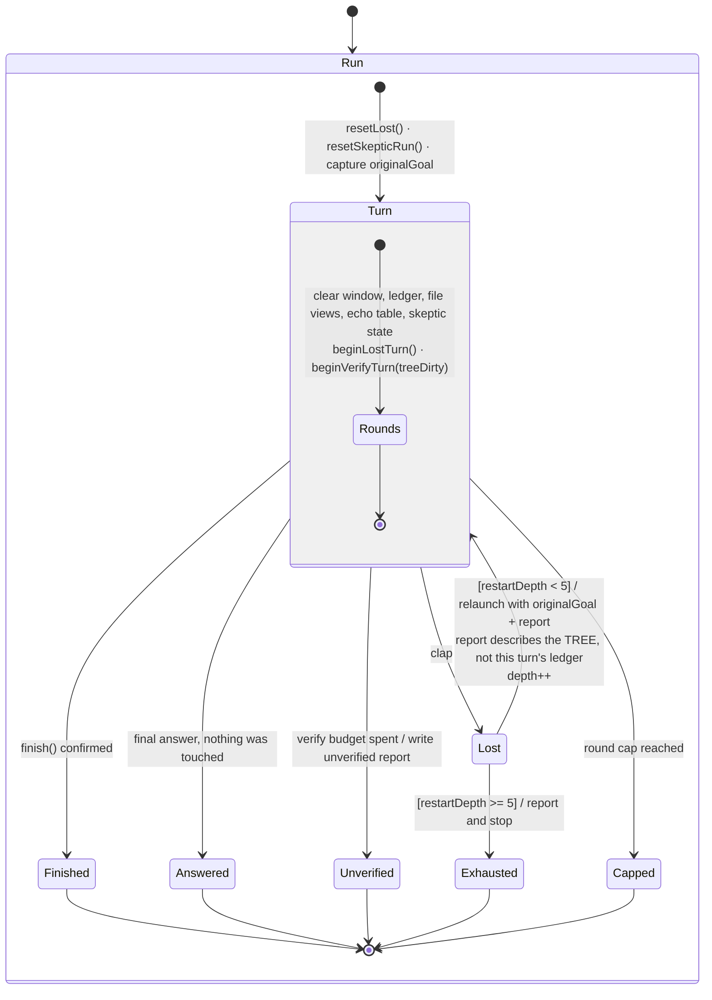
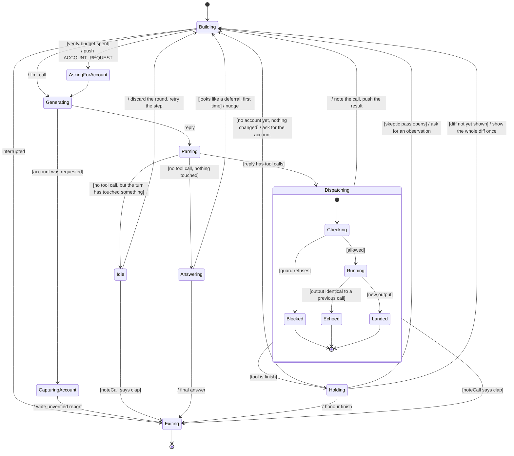
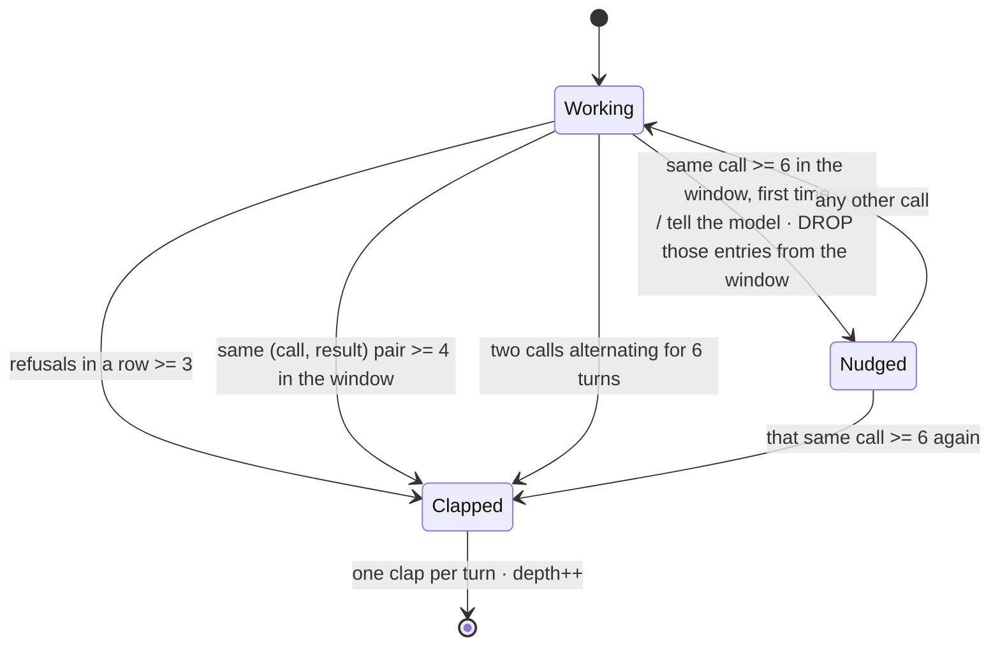

# The agentic loop — as a state machine

`ARCHITECTURE.md` says what the parts are. This says **what the loop is doing at any instant, and
every way it can leave.** It is a UML state machine diagram (a statechart).

Read it like this:

- A **rounded box is a state.** The loop is in exactly one of them at a time.
- An **arrow is a transition**, labelled `event [guard] / action`: *when this happens, if this holds,
  do this, then move.*
- `[*]` at the top is where a turn starts; `[*]` at the bottom is where it ends.
- A **box drawn inside a box** is a nested machine — the round loop lives inside the turn.

Why this diagram and not a sequence diagram or a flowchart: a statechart forces every state to
enumerate **all** of its exits. A state with a way in and no guard on the way out is visible at a
glance, and that class of defect is the expensive one here — see `RESTART_MAX` in `src/lost.ts`.

---

## 1 · The run, the turn, and the restart chain

A **run** is one task. A **turn** is one attempt at it with one context. A clap ends a turn and starts
a new one — same process, fresh context, carrying a report.

**The load-bearing guard is `[restartDepth >= 5]`.** Without it `Lost --> Turn` is unconditional and
the machine has no exit: measured at twelve restarts and four hours of wall clock on one instance,
with duration tracking `(restarts + 1) x one attempt` almost linearly. Every run that ever reached
`Finished` did so at depth 5 or less.

Two things deliberately do **not** reset on `Lost --> Turn`: `restartDepth`, so the chain can be
bounded, and the accumulated dead ends, so attempt 5 knows which routes attempts 1–4 closed. Everything
else is wiped — that is what "sober" means.

**The report's contents must come from state the transition does not clear.** They did not: `changed`
was read from the per-turn QA ledger, which the next turn's entry action wipes. A restarted turn
therefore reported "Nothing. The working tree is clean." over a correct one-line fix sitting in the
file, and took the no-edit branch of the mandate — *"Make the edit the task asks for"* — telling the
agent to redo work it had already done. That is how a clean fix acquires a second, conflicting one.
It now reads `git status --porcelain`: the tree survives a restart, and `status` rather than
`diff --name-only` because a file the agent CREATED is a change the report must name.

---

## 2 · Inside a turn: one round

`Blocked`, `Echoed` and `Landed` all report to the same detector. That matters: the first version of
the detector only saw `Blocked`, and was therefore blind to the loop that actually burns the card —
accepted calls, each differing from the last by a few bytes, cycling forever.

`Holding` is where `finish()` goes to be questioned. Each of its three gates fires **at most once per
turn**, so the door cannot be held shut indefinitely; the next `finish()` after each one is honoured.

---

## 3 · The detector (`src/lost.ts`)

Runs on every call — blocked, echoed or landed. It holds a window of the last 20 `(call, result)`
pairs and asks one question: *did the last stretch of work do anything new?*

**`/ DROP those entries from the window` is not bookkeeping — it is the whole mechanism.** Without it
the six copies that triggered the nudge stay in the window, so the model's *next* call — any call —
re-satisfies the rule with the key already marked, and claps. Measured twice on live runs: nudge at
round 37, clap at round 38, zero refusals in the entire run. A nudge the model is given no room to obey
is a clap with a longer name.

The same-call rule is the only one that nudges first. The other three are never productive: identical
refusals, an identical call *and* result, two calls taking turns. This one can be — six runs of a
reproduction script is plausibly a model building understanding.

**No budget lives in this file.** Not rounds, not money, not a clock. It never asks how much work has
been done, only whether the last stretch of it was the *same* work. A run that keeps learning things
runs forever, by design; `finish()` remains the only ordinary way out.

---

## Keeping this true

This diagram is behaviour, so the rule in `CLAUDE.md` applies: **a change to the loop updates this file
in the same change.** Concretely, a change needs an edit here when it adds or removes a state, adds or
removes a way out of one, or changes a guard's condition. Renaming a variable does not.

The three files this describes: `src/agent.ts` (the turn and the round), `src/lost.ts` (the detector
and the restart bound), `src/skeptic-pass.ts` (the verification budget and the `finish` gates).
